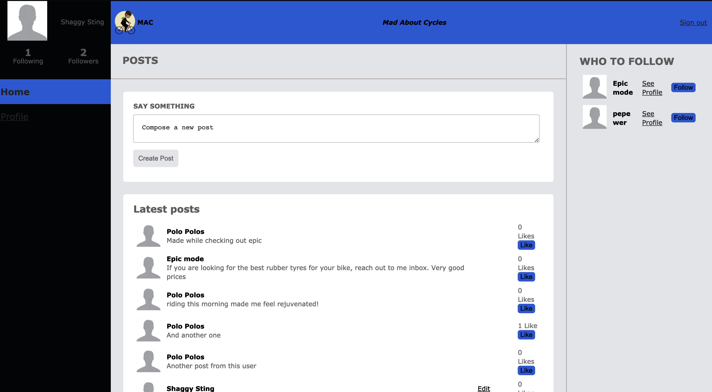

# MA-Cycles

This is the MVP of a socializing app built as my capstone project for the Rails course at Microverse.

The application is built with the Ruby on Rails framework and its purpose is to provide a discussion board for cycling lovers, business-people, and enthusiasts.

## Screenshot

 

## Built With

- Ruby on Rails
- HTML5, CSS3
- FlexBox, Grid

## Live Demo


## Getting Started

To get a local copy up and running follow these simple example steps.

### Prerequisites

- Ruby: 2.6.3
- Rails: 5.2.3
- Postgres: >=9.5
- Web Browser


### Setup

`$git clone https://github.com/pbkabali/MA-Cycles`

### Setup

Instal gems with:

```
bundle install
```

Setup database with:

```
   rails db:create
   rails db:migrate
```

### Install

- Run a local server

### Usage

Start server with:

```
    rails server
```

Open `http://localhost:3000/` in your browser.

### Run tests

```
    rspec
```
## Authors

👤 **Paul Balitema Kabali**

- Github: [@pbkabali](https://github.com/pbkabali)
- Twitter: [@pbkabali](https://twitter.com/pbkabali)
- Linkedin: [engineerbpk](https://linkedin.com/in/engineerbpk)

## 🤝 Contributing

Contributions, issues and feature requests are welcome!

Feel free to check the [issues page](https://github.com/pbkabali/MA-Cycles/issues).

## Show your support

Give a ⭐️ if you like this project!

## Acknowledgments

- [Gregoire Vella on Behance](https://www.behance.net/gregoirevella)
- Microverse Team 140 (The Cupids)

## 📝 License

This project is [MIT](https://opensource.org/licenses/MIT) licensed.
